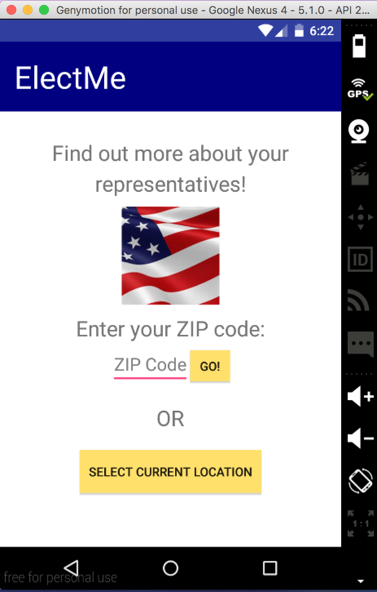
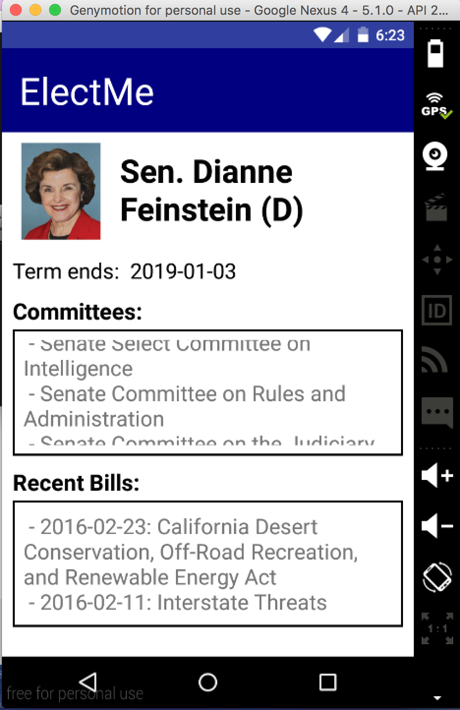
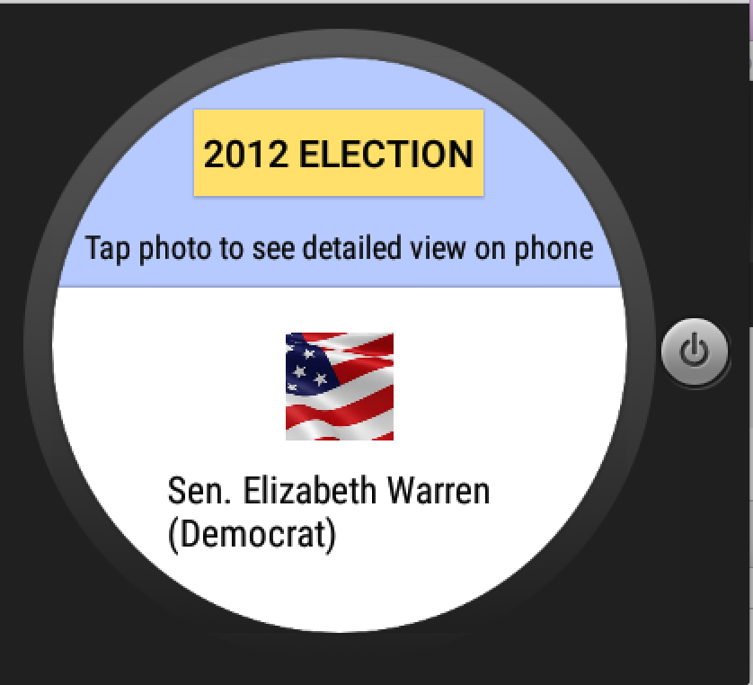
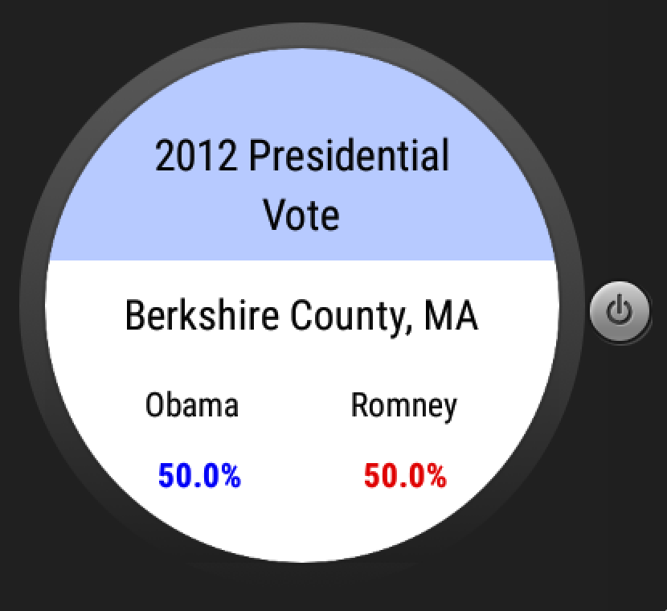

# PROG 02: Represent!

Informational application designed for smartphone and smartwatch. Using either the phone's current location or an inputted Zip Code, the app uses APIs to retrieve legislators who represent that location. It displays photos, email and website links, and recent tweets on the phone while simultaneously displaying cards on the smartwatch for each legislator (Senators and Representatives). Tapping one of the cards on the watch or tapping a legislator photo on the phone will load a detailed view on the phone, which uses APIs to retrieve the legislator's end-of-term date, committees he or she serves on, and bills he or she sponsored. On the watch, the user can tap a button to see the 2012 presidential vote distribution for the county in which the location exists (Obama v. Romney). Additionally, the app takes advantage of the accelerometer sensor on the watch: shaking the watch will generate a random location and display information based on that, with all the aforementioned functionality.

## Authors

Courtney Vu ([vucourtney@berkeley.edu](mailto:vucourtney@berkeley.edu))

## Demo Video

See Demo Video: (https://youtu.be/f0LRX_Dp8iQ)

## Screenshots

## Acknowledgments

CS160 Spring 2016 Staff - Sample Code for Phone-Watch Communication
